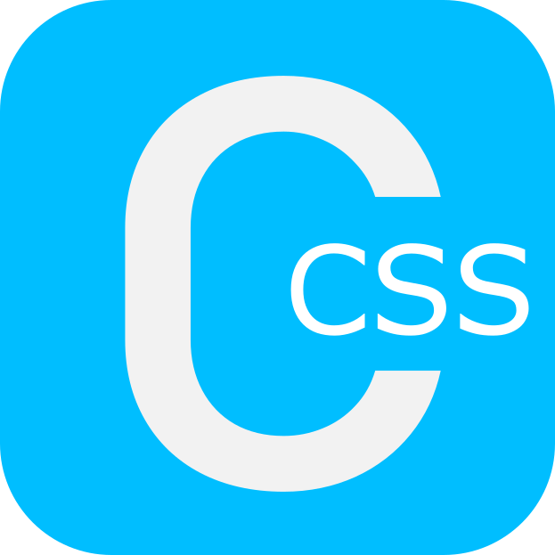

<div align="center">
<h1>CSS Colors</h1></div>

## CSS COLORS 1


A CSS library that provides a comprehensive list of color classes, to be applied to your HTML elements.

Avoid:
- Creating new classes or using in-line styles to change an elements color
- Having to edit, save and reload your web projects to test a color
- Needing to search Google for the hex code of your desired color

## Usage
### Apply to project
This project uses a free CDN provided by: [GitHack.com](https://raw.githack.com/).

To use the CDN copy the following into the 'head' section of your HTML file:
```html
 <link rel="stylesheet" href="https://raw.githack.com/seanb126/css-colors/main/colors.css">
```
### Text Color

```html
<h1 class="royal-blue">Hello World!</h1>
```

### Background Color
Add the keyword 'bg' before the desired color:
```html
<div class="bg-royal-blue"></div>
```
### Invert Color
This class will invert the elements color:
```html
</img>
```


## Contributing
Contributions are welcome! The project is always looking out for new colors and more features.

feel free to fork the project, make your desired changes, then open a pull request from the fork to the main (this repo). Just ensure that the pull request comment includes:
- NAME: i.e. color: Magenta
- DESCRIPTION: This adds the color Magenta to the library.

## Issues

Feel free to report any problems in the issues section.

## License
(See LICENSE)